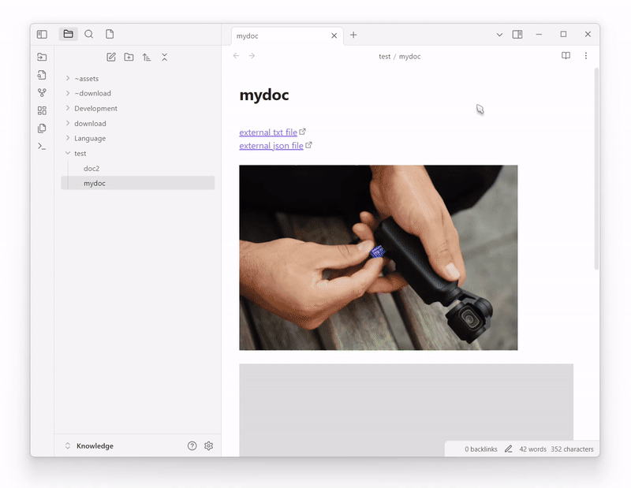

# Obsidian Plugin: Local any files

English | [简体中文](README.zh-CN.md)

A powerful Obsidian plugin that helps you `extractExternalLinks`,`downloadFileLocally` and `replaceExternalLinks`. 

It supports a wide range of file types and provides flexible configuration options for organizing your attachments.

## Features

- **Wide File Type Support**: Preset groups for various file types.
  - **Images**: `.png`, `.jpg`, `.jpeg`, `.gif`, `.bmp`, `.svg`, `.webp`, `.tiff`, `.ico`, `.raw`, `.heic`, `.heif`, `.avif`, `.jfif`
  - **Office Files**: `.doc`, `.docx`, `.xls`, `.xlsx`, `.ppt`, `.pptx`, `.pdf`, `.odt`, `.ods`, `.odp`, `.rtf`, `.txt`, `.csv`, `.epub`, `.pages`, `.numbers`, `.key`
  - **Archives**: `.zip`, `.rar`, `.7z`, `.tar`, `.gz`, `.bz2`, `.xz`, `.iso`, `.tgz`, `.z`, `.bzip2`, `.cab`
  - **Music**: `.mp3`, `.wav`, `.flac`, `.m4a`, `.ogg`, `.aac`, `.wma`, `.aiff`, `.alac`, `.mid`, `.midi`, `.opus`, `.amr`
  - **Videos**: `.mp4`, `.avi`, `.mkv`, `.mov`, `.wmv`, `.flv`, `.webm`, `.m4v`, `.mpg`, `.mpeg`, `.3gp`, `.ogv`, `.ts`, `.vob`
  - **Code Files**: `.js`, `.ts`, `.jsx`, `.tsx`, `.html`, `.css`, `.scss`, `.json`, `.xml`, `.yaml`, `.yml`, `.md`, `.py`, `.java`, `.cpp`, `.c`, `.cs`, `.php`, `.rb`, `.go`, `.rs`, `.swift`
  - **Fonts**: `.ttf`, `.otf`, `.woff`, `.woff2`, `.eot`
  - **Design Files**: `.psd`, `.ai`, `.eps`, `.sketch`, `.fig`, `.xd`, `.blend`, `.obj`, `.fbx`, `.stl`, `.3ds`, `.dae`
  - **Databases**: `.sql`, `.db`, `.sqlite`, `.mdb`, `.accdb`, `.csv`, `.tsv`
  - **Ebooks**: `.epub`, `.mobi`, `.azw`, `.azw3`, `.fb2`, `.lit`, `.djvu`
  - **Academic**: `.bib`, `.tex`, `.sty`, `.cls`, `.csl`, `.nb`, `.mat`, `.r`, `.rmd`, `.ipynb`

- **Smart Processing**:
  - Extracts links from your notes
  - Downloads files locally
  - Automatically replaces links with local paths

- **Intuitive Process View**:
  - Real-time progress tracking
  - Clear success/failure indicators
  - Detailed logs for each operation
  - Visual progress bar for better feedback

- **Flexible Scope Options**:
  - Process current file only
  - Process entire current folder
  - Process all files in vault
  - Process single items through context menu

- **Separated Tasks**:
  - `Extract External Links`: Find all external links in your notes
  - `Download File Locally`: Download external files to your vault
  - `Replace External Links`: Update links to point to local files
  - Customize which tasks to run based on your needs

- **Customizable Store Path and File Name**:
  - Dynamic store path with variables support:
    - `${path}`: Current note's path
    - `${notename}`: Current note's name
  - Flexible file naming with variables:
    - `${originalName}`: Original file name
    - `${date}`: Current date
    - `${time}`: Current time
    - `${md5}`: Random string
    - `${extension}`: File extension

## Comparison with `obsidian-local-images`

While `obsidian-local-images` is a great plugin focused on image attachments, `obsidian-local-any-files` extends similar functionality to a much wider range of file types:

- **File Type Support**:
  - `obsidian-local-images`: Focuses on image files only
  - `Local any files`: Supports images, documents, archives, media, code files, and many more

- **Processing Options**:
  - `obsidian-local-images`: Processes images in the current note
  - `Local any files`: Flexible scope options (current file, folder, entire vault, or single items)

- **Configuration**:
  - `obsidian-local-images`: Basic image-focused settings
  - `Local any files`: Extensive configuration options for file types, storage paths, and naming patterns

- **Organization**:
  - `obsidian-local-images`: Standard image organization
  - `Local any files`: Customizable storage paths with variables for better organization

## Usage
 
### Quick Start

1. Install the plugin from Obsidian Community Plugins
2. Configure desired file types in settings:
   - Enable preset groups (images, documents, etc.)
   - Add custom extensions if needed

### Processing Files

#### Method 1: Command Palette
1. Open Command Palette (Ctrl/Cmd + P)
2. Search for "Local any files" or "Download attachments from links"
3. Choose processing options in the modal

#### Method 2: Context Menu
1. Right-click on a link in your note
2. Select "Download to local" option
3. Configure options in the modal

### Configuration

#### Storage Path
- Default: `assets/${path}`
- Variables available: 
  - `${path}`: Current note's path
  - `${originalName}`: Original filename

#### Custom Extensions
- Add your own extensions in settings
- Format: `.ext` (e.g., `.pdf`, `.custom`)
- Multiple extensions: `.pdf|.txt|.md`

## Support

- [GitHub Issues](https://github.com/ShermanTsang/obsidian-local-any-files/issues)
- [Feature Requests](https://github.com/ShermanTsang/obsidian-local-any-files/issues/new)